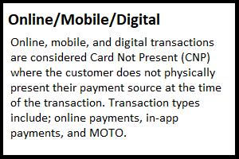
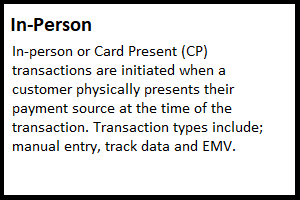
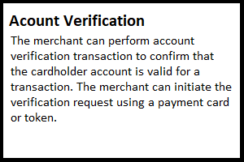
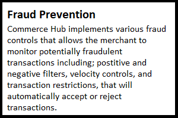
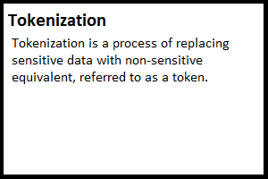

# Getting Started with Commerce Hub

Commerce Hub provides a [simple way](?path=docs/Getting-Started/Getting-Started-Dev-Portal.md) to integrate payment acceptance functionality and gives you access to a comprehensive suite of global commerce assets. Commerce Hub offers a variety of payment options ranging from debit cards, credit cards and eChecks to digital payments like Apple Pay, PayPal, and Google Pay.

Beyond accepting customer payments, Commerce Hub's services include; tokenization, account verification, fraud prevention, 3-D Secure, AVS/CVV filtering, creating and managing recurring payments, installments and deferred payments, split shipment, EMV and contactless payments, secure hosted Payment Pages, Payment URLs, and more.

---

## Integration Options

 

---

## Features

  

  

- [Apple Pay](?path=docs/Online-Mobile-Digital/Wallets-AltPayments/Apple-Pay/Apple-Pay.md)
- [Split Shipment](?path=docs/Resources/Guides/Split-Shipment.md)
- [Stored Credentials](?path=docs/Resources/Guides/Stored-Credentials.md)

---
