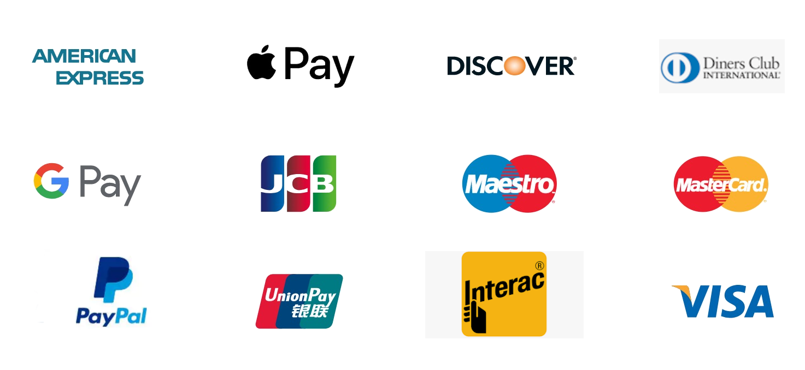

## Welcome to Commerce Hub

Thank you for visiting commerce-HUB website. Our gateway provides a simple way to integrate payment acceptance functionality and gives you access to a comprehensive suite of global commerce assets. We Offers a variety of payment options ranging from debit cards, credit cards and eChecks to digital payments like Apple Pay, PayPal, and Google Pay.

See below for the most popular options

Beyond accepting customer payments, our services include Tokenisation, 3DSecure, Pre-Authorisation functionality, capturing Charges, Refund, Canceling (void) charge, creating and managing Recurring Payments, Installments, Deferred Payments, Split Shipment, AVS and Payment URLs.

---

## Access Commerce Hub APIs

Follow the below steps to get an access to our development portal and use our APi's

### 1. Sign up on our Developer Platform

Head over to [Commerce-HUB](url) Developer platform and create an account.

<!-- theme: info -->

> ### Instant Access
>
> After registration the developer will have an instant access to the Commerce Hub APIs.

### 2. Generate an API key

Go to the Apps page and create a Sandbox app.

Once you're on the Apps page copy your API key and Secret Key.

For most of our APIs you can just put the API Key into the header under the API-Key parameter. However, when you use our Payment APIs you'll need to add them to a [Message-Signature](Message-Signature.md) you an find out more about that in the next page.

### 3. Constructing the API call

Please refer our [API page](Use-Our-APIs.md) to know about how to use Commerce Hub APIs.

### 4. Integrate to Commerce Hub

- [Card Present](Getting-Started/Getting-Started-CP.md)
- [Card Not Present](Getting-Started/Getting-Started-CNP.md)
- [Wallets](Getting-Started/Getting-Started-Wallets.md)

#### Transaction Types

- [Charge](../Transactions/Charges.md)
- [Capture](../Transactions/Capture.md)
- [Cancel](../Transactions/Cancel.md)
- [Refund](../Transactions/Refund.md)
- [Inquiry](../Transactions/Inquiry.md)

#### Value Added Services

- Acount Verification
- Authentication
- Payment Token

<!--

https://docs.fiserv.com/docs/payments/docs/Welcome%20to%20Fiserv%20Payments.md
+
https://docs.fiserv.com/docs/payments/docs/1.%20Introduction
%20to%20Fiserv%20Payments/Get%20started.md

>

