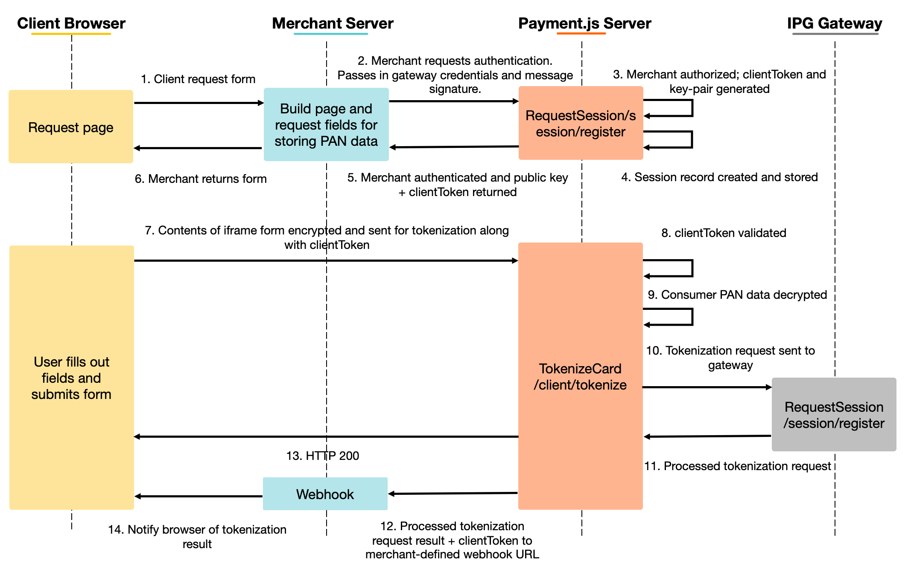

# Sequence-flow

1. Consumer visits merchant’s payment page; merchant will return payment page back to consumer’s web browser including the payment.js javascript library (referenced within merchant’s payment page script tag).

2. Merchant initiates an authorize session request; merchant sends in a few headers including a message signature that’s signed with their API secret and a nonce, timestamp etc. Also sends in their gateway credentials.

3. Payment.js server validates message signature + api key, generates an OAUTH token (called the clientToken). This has a one-time use with an expiration date. Payment.js server also requests a key-pair generated from a Fiserv crypto service; crypto service returns public key and key-pair id

4. Payment.js server creates a session record. Merchant gw credentials, key-pair id, and merchant-defined web hook stored for later use in the flow.

5. Public key + clientToken returned to merchant's server

6. Merchant returns payment form including iframed fields to client browser.

7. Consumer fills out and submits payment form. All payment fields (card number, cardholder name, expiration date, cvv2) encrypted with public key from pre flow

8. Payment.js server validates clientToken, then uses clientToken to do a lookup to grab the merchant’s gateway config. Session record containing merchant's session data deleted.

9. Payment.js server uses the key-pair ID from the sessionrecord together with the encrypted data from the consumer to request decryption from the First Data crypto service. Data decrypted and returned to Payment.js server

10. Payment.js server takes decrypted data, formats that into something that the target gateway accepts, and sends off a tokenization request to the gateway

11. Gateway processes tokenization request and returns response to Payment.js server.

12. Payment.js server forwards response to a merchant-defined web hook

13. Payment.js server also returns a HTTP 200 back to the client indicating that the tokenization request has completed. clientToken is now revoked and cannot be used for any further tokenization requests

14. Merchant webform should be updated to notify user that the tokenization request was successful or failed.

15. At this point, the payment.js flow has completed. Merchant would save token generated from the payment.js request in a database on their end and/or then do a subsequent auth or sale transactions using the token to charge the consumer.
