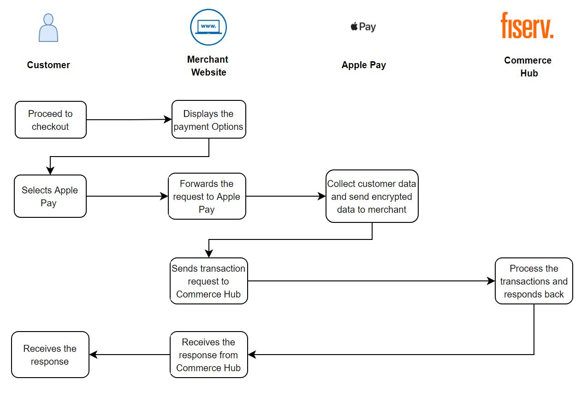
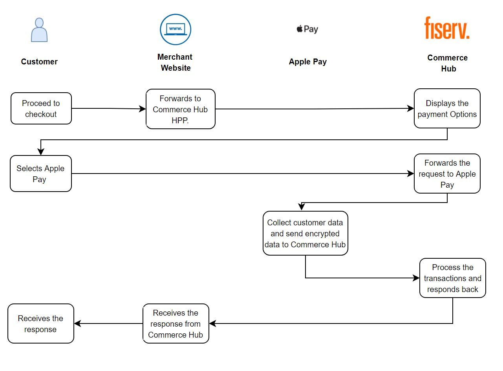
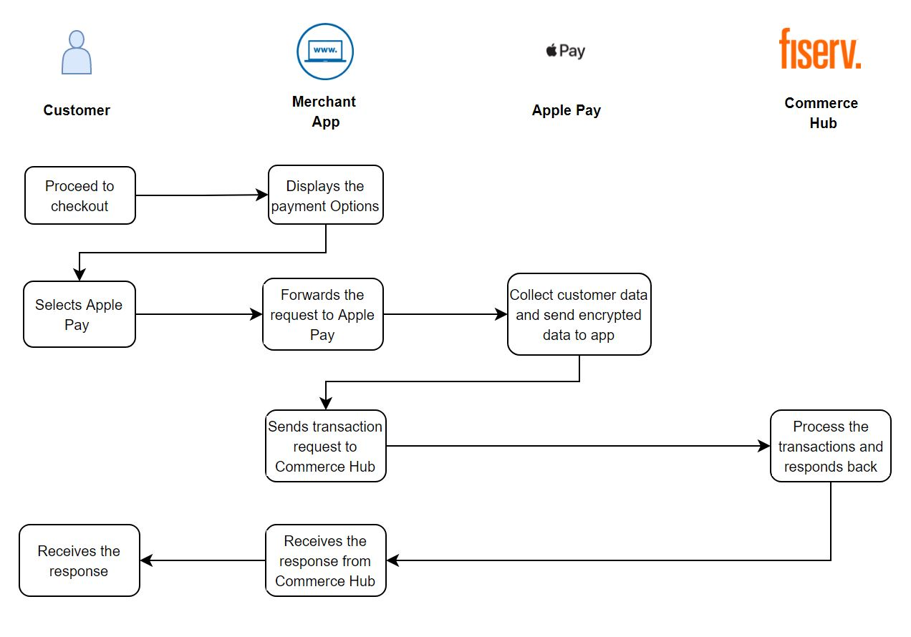

# Apple Pay Updated

## Overview

Commerce Hub allows developers to quickly enable secure and convenient Apple Pay payments in their app or website.

<!-- theme: info -->
>Apple Pay is available to cardholders at participating banks in supported countries. Refer to Apple’s [participating banks](https://support.apple.com/en-us/HT204916) documentation to learn about supported banks and countries.

---

## Integration Methods

Select an option below to see the integration steps.

### Web: RESTful API

Commerce Hub's RESTful API integration allows the merchant to create a custom UI integration with Apple Pay. The merchant will host the payment processing on their server and has full control over the look and feel. 

<!-- theme: warning -->
> Merchants are required to have the relevant Payment Card Industry (PCI) Compliance capabilities to process and store card data.

#### Transaction Flow

1. The customer selects checkout from the merchant's website and the merchant’s payment form displays.
2. The customer selects Apple Pay and the Apple Pay payment form displays.
3. The customer completes the Apple Pay form and returns to the merchant's website.
4. The customer selects to complete the transaction.
5. The merchant’s website submits the encrypted Apple Pay payload to Commerce Hub.
6. Commerce Hub attempts to process the transaction and sends the response to the merchant’s website.

Adding one more image 

**Begin integration with [Apple Pay on the Web: RESTful API](?path=docs/Online-Mobile-Digital/Wallets-AltPayments/Apple-Pay/Apple-Pay-Web-REST.md).**

### Web: Hosted Payment Page

Commerce Hub's Hosted Payment Page integration removes the PCI Compliance requirement on the merchant server by handling the payment processing form on Commerce Hub's secure server. The merchant can customize the look and feel of the payment form.

#### Transaction Flow

1. The customer selects checkout from the merchant's website and Commerce Hub's secure Hosted Payment Page displays.
2. The customer selects Apple Pay and the Apple Pay payment form displays.
3. The customer completes the Apple Pay form and returns to the Hosted Payment Page.
4. The customer selects to complete the transaction.
5. The Hosted Payment Page submits the encrypted Apple Pay payload to Commerce Hub.
6. Commerce Hub attempts to process the transaction and sends the response to the merchant’s website.

**Begin integration with [Apple Pay on the Web: Hosted Payment Page](?path=docs/Online-Mobile-Digital/Wallets-AltPayments/Apple-Pay/Apple-Pay-Web-HPP.md).**

### In-App Integration

Commerce Hub's RESTful API integration allows the merchant to create a custom App integration with Apple Pay. The merchant will present the payment processing form on their App and submit the transaction to Commerce Hub.

#### Transaction Flow

1. The customer selects checkout from the merchant's app and the merchant’s payment form displays.
2. The app calls the Apple Pay framework to obtain the encrypted wallet data.
3. The merchant’s app submits the encrypted Apple Pay payload to Commerce Hub.
4. Commerce Hub attempts to process the transaction and sends the response to the merchant’s app.

**Begin integration with [Apple Pay Integration In-App](?path=docs/Online-Mobile-Digital/Wallets-AltPayments/Apple-Pay/Apple-Pay-App.md).**

---

## See Also

- [API Explorer](../api/?type=post&path=/payments/v1/charges)
- [Google Pay](?path=docs/Online-Mobile-Digital/Wallets-AltPayments/Google-Pay/Google-Pay.md)

---