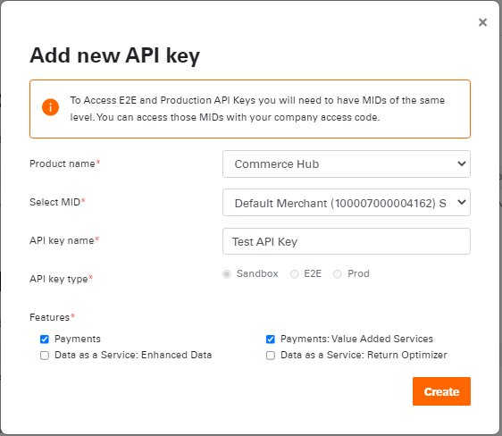

# API Key-Management

## Create a API Key

Developers can create and manage API Keys from the Dashboard in the API Key section.

### Step 1: Access Developer Studio

Login to the Developer Studio and access the Developer Dashboard. 

### Step 2: Add a new API Key

Click Add API Key. Select a Product Name from the dropdown. Select the Merchant ID from the dropdown. Create a API Key Name. Select the API Key Type from the following list and click Create.

- **Sandbox:** Used to certify you API environment
- **End-To-End:** Used to certify your API application
- **Production:** Used to obtain production API credentials 

Select features from the following:

- Payments
- Payments: Value Added Services
- Data as a Service: Enhanced Data 
- Data as a Service: Return Optimizer

<!-- theme: info -->
> Once your API Key has been successfully created, copy or save a pdf of your API Key/Secret.

---

## See Also

- [API Explorer](../api/?type=post&path=/payments/v1/charges)
- [Account Management](?path=docs/Resources/Guides/Dev-Studio/Account-Management.md)
- [Certification](?path=docs/Resources/Guides/Dev-Studio/Certification.md)
- [Transaction Verification](?path=docs/Resources/Guides/Dev-Studio/Transaction-Verification.md)
---
