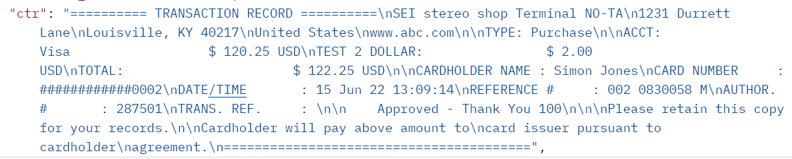

# Customer Transaction Record (CTR) Response Element Creation

<!-- theme: danger -->
>  The following documentation is for **Payeezy** migration clients only. See [Getting Started](?path=docs/Getting-Started/Getting-Started-General.md) for Commerce Hub integration options.

Commerce Hub will not be providing a single CTR element in the API response.  The purpose of this page is to provide developers with the element equivalent list in Commerce Hub in order to recreate the CTR if neccessary.

**Payeezy CTR Example:**

### CTR Creation from Commerce Hub Elements
Click [here](https://github.com/Fiserv/Commerce-Hub/raw/Payeezy-Migration/docs/Resources/Guides/Payeezy/Customer_Transaction_Record_Creation.xlsx) to download the table in Excel. _Last Updated: June 15, 2022_

| Payeezy Customer Transaction Record (CTR)| Commerce Hub Elements | 
| :-------------------------------------- | :------------- |
|========== TRANSACTION RECORD ========== | CTR+10 equal Symbols + TRANSACTION RECORD + 10 equal symbols |
| SEI stereo shop Terminal| paymentReceipt.merchantName |
|1231 durrett lane |paymentReceipt.merchantAddress |
|louisville, KY 40217 | paymentReceipt.merchantCity + , + paymentReceipt.merchantStateOrProvince + paymentReceipt.merchantPostalCode|
|United States| paymentReceipt.merchantCountry|
|TYPE: Purchase | TYPE: +   if charges endpoint and transactionDetails.captureFlag = true, then "Purchase"   if charges endpoint and transactionDetails.captureFlag = false, then "Pre - Authorization"   if cancel endpoint  then "Void"   if refund endpoint  then "Refund" |
|ACCT: Visa                    $ 5.00 USD| ACCT: + cardDetails.brand + $ + paymentReceipt.approvedAmount.total + paymentReceipt.approvedAmount.currency |
|FEE NAME:                    $ 2.00 USD | FEE NAME: + $ + AmountComponents.convenienceFee + paymentReceipt.approvedAmount.currency |
|TOTAL:                        $ 7.00 USD | TOTAL: + $ + (paymentReceipt.approvedAmount.total + AmountComponents.convenienceFee) + paymentReceipt.approvedAmount.currency |
|CARDHOLDER NAME : Joe Public | CARDHOLDER NAME: source.card.nameOnCard |
|CARD NUMBER     : ############1111 | CARD NUMBER: +   if cardDetails.brand = "Amex" then ########### + source.card.last4   else ############ + source.card.last4|
|DATE/TIME       : 10 May 21 12:59:08 | DATE/TIME: + gatewayresponse.transactionProcessingDetails.transactionTimeStamp  |
|REFERENCE #     : 001 0599326 M| REFERNCE #: merchantDetails.terminalId + gatewayResponse.transactionProcessingDetails.orderId + M |
|AUTHOR. #       : 875006 | AUTHOR. #: + PaymentReceipt.ProcessorResponseDetails.ApprovalCode |
|TRANS. REF.     : Invoice A | TRANS. REF.: + transactionDetails.merchantInvoiceNumber |
|Approved - Thank You 100 | If paymentReceipt.processorResponseDetails.approvalStatus = APPROVED then "Approved - Thank you 100"   If paymentReceipt.processorResponseDetails.approvalStatus = DECLINED  then "Not Approved" |
|Please retain this copy for your records. Cardholder will pay above amount to card issuer pursuant to cardholder agreement. | Hardcoded and should match exctly -> Please retain this copy for your records. Cardholder will pay above amount to card issuer pursuant to cardholder agreement. |
|========================================| 40 equal symbols|
  
---

## See Also

- [Payeezy Merchant Migration Playbook](?path=docs/Resources/Guides/Payeezy/Payeezy-Migration-ExtendedLanding.md)
- [API Explorer](../api/?type=post&path=/payments/v1/charges)
- [CH Overview](?path=docs/Getting-Started/Getting-Started-General.md)

---
