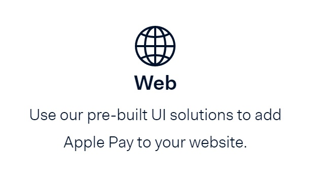

## Apple-Pay

&nbsp;

###### Apple Pay enables secure, simple checkouts in your app or on your website. 

### Overview
Our API allows developers to quickly enable secure and convenient payments in their payment applications. The API handles all of the tokenization needed to protect customers’ transactions.

&nbsp;

**User Action:** The Buyer taps the Apple Pay button in the app or on the website, selects the payment card and uses the Touch-ID to complete the transaction.
1. The Merchant App communicates with the merchant server and creates a transaction ID
2. The Merchant App obtains the encrypted transaction payload (The tokenized card data "DPAN", Cryptogram, and transaction details) from Apple's Pass Kit Framework
3. The Merchant App sends the encrypted transaction payload to processor API using the Apple Pay SDK
4. Processor API decrypts the encrypted transaction payload and processes the transaction
5. Processor API responds back to the Merchant App (through the SDK) with either an approval or decline
6. To get more information on participating banks and countries for Apple Pay, click here.

&nbsp;

### Minimum Technical Requirements

Please Follow the [link](https://www.apple.com/apple-pay/) for details

&nbsp;

### Pre-Requisites

Before integrating with our APIs, developers should first:
- Review the prerequisites described in Getting Started Guide.
- Complete registration and certification to the APIs at the Developer Portal, if necessary.
- Download a Certificate Signing Request (CSR) from the My Merchants page in the developer's Developer Portal account.

&nbsp;

### How would you like to Integrate

 

